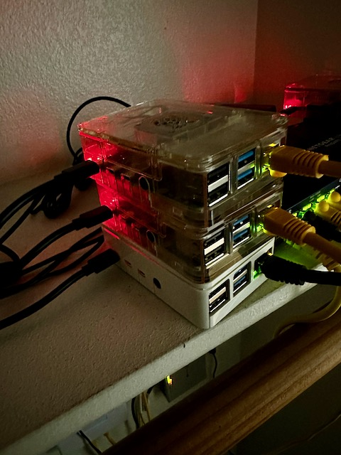

# Kubernetes @ Union Squared

## Introduction

This is an overview of my fake company's Kubernetes cluster constructed on three Raspberry Pies. Here, I will go over, the construction and architecture of my "Kuberry Pi" cluster. This will be less of a "how to" and more of a white paper.

## Why?

At this writing, current task at my bill-paying job involves a high amount of Kubernetes usage, a technology in which I have non-trivial amount of knowledge, but I am far from any kind of SME or even an authority over. I'm an avid proponent of Docker and container applications and microservice architecture. I can get around well enough in Docker, but Kubernetes is a different matter. So, I set about improving my Kubernetes knowledge. Now, I could have taken the easy route and just installed `minikube` or `microk8s` on my laptop and be done with it. But, where is the fun in that? Also, I had three Raspberry Pies kind of doing nothing but, adding to my power bill. So, I though, why not? This actually wasn't my first attempt at a K8S cluster on Pies. But, that first attempt was met with little success. So, why not try again?

## Construction

    

My cluster is a three node cluster, one server, and two agents. The server is a Raspberry Pi 4 4GB w/ 32 GB micro SD and the two agents are both Raspberry Pi 4 8GB w/64 GB micro SD. Makes sense to have the agents with more storage and memory. Each node is running on Ubuntu 23.04 64-bit. The flavor of Kubernetes I chose this time around was [k3s](https://k3s.io). K3s is designed to be lightweight enough for architectures such as ARM (Raspberry Pi). Plus, they offer an [Ansible playbook](https://github.com/k3s-io/k3s-ansible) which greatly reduced the complexity and time needed to get the cluster operational.

## Architecture

### Physical

The cluster is a three-node cluster running k3s on Raspberry Pi 4. Storage on each of the nodes is handled by Rancher's Local Path Provisioner which comes out-of-the-box with k3s. This storage class allows the quick creation of persistent volume claims which uses the node's local storage. There is no need to first establish a persistent volume then create claims. Local Path will create a PV and then bind to the claim. 

### Networking